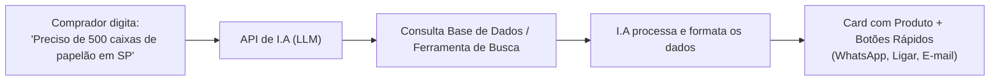

# Centralização de Fornecedores e Compradores com I.A

## 📌 Visão Geral da Ideia
A plataforma tem como propósito conectar e centralizar **fornecedores** e **compradores** em um ambiente único, veloz e simplificado. Utilizando sistemas de Inteligência Artificial, o comprador pode realizar buscas e cotações em linguagem natural, recebendo instantaneamente os produtos recomendados e canais de contato direto (**WhatsApp**, **telefone** e **e-mail**).

---

## 🚀 Fluxo de Funcionamento

---

## 🛠️ Estratégias de Consulta no Início (MVP)

### 1. Consulta à Base Interna (Recomendada para o início)
* **Como funciona:** Fornecedores e seus respectivos produtos/serviços ficam cadastrados no banco de dados da plataforma (SQLite via Prisma).
* **Papel da I.A:** Através de **Function Calling (Tool Calling)**, a I.A interpreta a intenção do comprador, consulta a tabela de fornecedores/produtos e extrai as melhores opções.
* **Vantagens:** 
  * Informações confiáveis e verificadas (evita alucinação da I.A).
  * Controle sobre quais fornecedores ganham destaque.
  * Resposta ultrarrápida.

### 2. Consulta Externa / Web Search (Descoberta Ativa)
* **Como funciona:** Caso o comprador busque um item não cadastrado no banco interno, a I.A pode acionar uma ferramenta de busca na web (ex: Google Search API, Tavily, Serper) através de `backend/integration/LLM/search_web_api.js`.
* **Papel da I.A:** Sintetizar os resultados encontrados na web e extrair dados públicos de contato comercial.

---

## 📲 Ações Imediatas de Contato (1 Clique)

Para proporcionar máxima velocidade e facilidade, a interface apresentará botões interativos diretamente no resultado da busca:

1. **WhatsApp Direto:**
   * Link com mensagem pré-configurada para iniciar a negociação:
   * Formato: `https://wa.me/55DDNNNNNNNNN?text=Olá!%20Encontrei%20seu%20produto%20na%20plataforma%20Compradores%20e%20gostaria%20de%20uma%20cotação.`
2. **Ligação Telefônica:**
   * Protocolo `tel:+55DDNNNNNNNNN` para discagem instantânea em celulares ou discadores desktop.
3. **E-mail Corporativo:**
   * Protocolo `mailto:contato@fornecedor.com?subject=Cotação%20via%20Compradores` com assunto e corpo pré-definidos.

---

## 📋 Passos Técnicos para Implementação

1. **Modelagem de Dados ([schema.prisma](backend/database/prisma/schema.prisma)):**
   * Criar entidades:
     * `Supplier` (Razão Social, Nome Fantasia, CNPJ, Cidade/UF, WhatsApp, Telefone, E-mail, Categoria).
     * `Product` (Nome, Descrição, Unidade de Medida, Preço Estimado/Faixa, Quantidade Mínima, `supplierId`).
2. **Módulo de Integração com I.A ([backend/integration/LLM/](backend/integration/LLM/)):**
   * Configurar cliente da API (OpenAI ou Google Gemini).
   * Implementar `tools_geral.js` com a função de consulta ao Prisma (`findSuppliersByNeed`).
3. **Endpoint no Backend ([backend/routes/](backend/routes/)):**
   * Rota POST `/api/ai/search` ou `/api/ai/chat` para receber a demanda do comprador e retornar os fornecedores sugeridos com os metadados de contato.
4. **Interface no Frontend ([frontend/](frontend/)):**
   * Barra de busca inteligente / chat com visual moderno (Tailwind CSS).
   * Renderização dos cards dos fornecedores com os botões de ação imediata.
